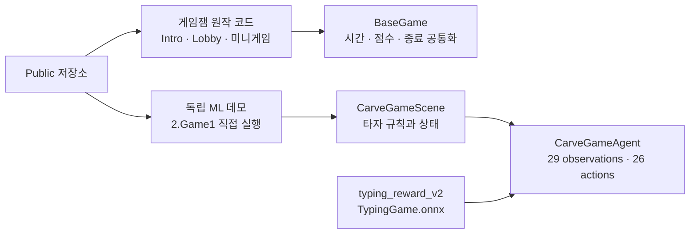
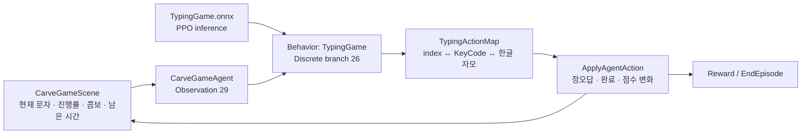
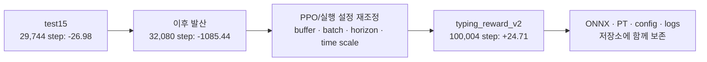

# 금속활자장 (Handicraft) — Unity Client · ML-Agents Portfolio

> Unity 미니게임 3종으로 구성된 게임잼 작품과, 타자 미니게임을 반복 가능한 ML-Agents 환경으로 재구성한 과정을 함께 담은 저장소입니다.

| 항목 | 내용 |
|---|---|
| 엔진 | Unity 2021.3.45f2 |
| 언어 | C# |
| 학습 환경 | Unity ML-Agents package 2.0.1 / Python trainer 0.26.0 / PPO |
| 역할 | 클라이언트 프로그래밍, 공통 게임 루프, 미니게임 3종, 학습 환경 재구성 |
| 실행 방식 | Public clone → Unity 2021.3.45f2 → `2.Game1` 직접 Editor Play (별도 빌드 불필요) |

## 1. 3분 검토 동선

| 시간 | 파일 | 확인할 내용 |
|---:|---|---|
| 0:00 | 아래 아키텍처 다이어그램 | 게임 흐름과 ML 경계를 먼저 파악 |
| 0:30 | [`Assets/Scripts/Scene/BaseGame.cs`](Assets/Scripts/Scene/BaseGame.cs) | 타이밍 계열 미니게임의 시간·점수·종료 흐름을 공통화한 구조 |
| 1:00 | [`Assets/Scripts/CarveGameScene/CarveGameAgent.cs`](Assets/Scripts/CarveGameScene/CarveGameAgent.cs) | 현재 `2.Game1` 씬에 연결된 29개 관측·26개 행동·보상·Episode 계약 |
| 2:00 | [`Assets/Scripts/CarveGameScene/TypingActionMap.cs`](Assets/Scripts/CarveGameScene/TypingActionMap.cs) | 키보드 입력, 한글 자모, ML action index 사이의 단일 매핑 경계 |
| 2:30 | [`docs/ML_EXPERIMENT.md`](docs/ML_EXPERIMENT.md) | 실패 로그 → 설정 재조정 → 보존 산출물까지의 근거 |

`Assets/Scripts/ML/TypingAgent.cs`는 별도 보상 설계를 시험한 실험 코드이며, 현재 `2.Game1` 씬에 연결된 Agent가 아닙니다. 현재 실행 경로는 `CarveGameScene/CarveGameAgent.cs`입니다.

## 2. 원작 게임과 ML 데모를 분리한 구조



타이밍 계열 미니게임은 시간 제한, 점수 집계, 시작·종료 판정을 [`BaseGame`](Assets/Scripts/Scene/BaseGame.cs)에서 공유합니다. `2.Game1`은 학습·추론 검토만 빠르게 할 수 있도록 [`CarveGameScene`](Assets/Scripts/CarveGameScene/CarveGameScene.cs)과 `CarveGameAgent`를 한 씬에 둔 **독립 ML 데모**입니다. 원작 전체 진행에 다시 합치는 것이 목적이 아니므로, 검토자는 `2.Game1`을 직접 열어 확인합니다.

| 계층 | 책임 | 대표 파일 |
|---|---|---|
| 타이밍 계열 공통 루프 | 시간 관리, 점수 집계, 시작·종료 판정 | [`BaseGame.cs`](Assets/Scripts/Scene/BaseGame.cs), [`TimingStyleGame.cs`](Assets/Scripts/Scene/TimingStyleGame.cs) |
| 현재 타자 게임 | 타자 규칙과 ML 상태 경계 | [`CarveGameScene.cs`](Assets/Scripts/CarveGameScene/CarveGameScene.cs) |
| 미니게임 규칙 | 유체·매칭 타이밍 규칙 | [`FluidTimingStyleGame.cs`](Assets/Scripts/Scene/FluidTimingStyleGame.cs), [`MatchingTimingStyleGame.cs`](Assets/Scripts/Scene/MatchingTimingStyleGame.cs) |
| 원작 씬 전환 코드 | Intro/Lobby/Game/Ending 전환과 전역 이벤트 | [`GameManager.cs`](Assets/Scripts/Core/GameManager.cs) |
| 상태/UI | 진행 데이터, 점수, 성공·실패·수집 UI | [`Assets/Scripts/Core`](Assets/Scripts/Core), [`Assets/Scripts/Popup`](Assets/Scripts/Popup) |

## 3. 현재 ML 실행 계약

`2.Game1.unity`의 `TypingGame` 오브젝트에는 `CarveGameAgent`, `BehaviorParameters`, `DecisionRequester`가 연결되어 있습니다. `BehaviorParameters`에는 저장소의 [`typing_reward_v2/TypingGame.onnx`](Assets/results/typing_reward_v2/TypingGame.onnx)를 연결했고, Agent의 serialized field는 씬의 `CarveGameScene` 컴포넌트를 참조합니다.



| 구분 | 현재 설계 | 코드 근거 |
|---|---|---|
| Observation | 현재 자모 one-hot 26 + 진행률 + 콤보 + 남은 시간 비율 = 29 | [`CarveGameAgent.CollectObservations`](Assets/Scripts/CarveGameScene/CarveGameAgent.cs) |
| Action | Discrete 26개를 `KeyCode`와 한글 자모로 변환 | [`TypingActionMap.cs`](Assets/Scripts/CarveGameScene/TypingActionMap.cs) |
| Reward | step -0.001 / 정답 +1 / 오답 -0.2 / 완성 +5 / 시간초과 -1 | [`CarveGameAgent.OnActionReceived`](Assets/Scripts/CarveGameScene/CarveGameAgent.cs) |
| Episode | 씬 reload 없이 `Clear → InitializeGameState → Init`으로 상태 초기화 | [`CarveGameAgent.OnEpisodeBegin`](Assets/Scripts/CarveGameScene/CarveGameAgent.cs) |
| 게임 경계 | Agent action을 실제 타자 규칙에 적용하고 결과 구조체 반환 | [`CarveGameScene.ApplyAgentAction`](Assets/Scripts/CarveGameScene/CarveGameScene.cs) |

### 코드 버전 구분

| 파일 | 상태 | 해석 |
|---|---|---|
| [`CarveGameScene/CarveGameAgent.cs`](Assets/Scripts/CarveGameScene/CarveGameAgent.cs) | **현재 씬 연결** | `2.Game1`과 `typing_reward_v2` 산출물이 추가된 현재 학습 경로 |
| [`ML/TypingAgent.cs`](Assets/Scripts/ML/TypingAgent.cs) | 별도 실험 | 다른 관측·콤보·피버 보상을 시도한 코드. 현재 씬 연결 아님 |
| [`ML-agent/CarveGameAgent.cs`](Assets/Scripts/ML-agent/CarveGameAgent.cs) | 레거시 보존 | 초기 접근을 비교하기 위해 남긴 이전 버전 |

## 4. 실패를 지우지 않은 실험 기록



| 실행 | steps | 기록된 reward | 해석 |
|---|---:|---:|---|
| `test15` | 29,744 | -26.98 | 해당 실행의 최고 checkpoint |
| `test15` | 32,080 | **-1085.44** | 최종 checkpoint에서 발산 |
| `typing_reward_v2` | 100,004 | **+24.71** | 재조정 후 양의 학습 reward로 종료 |

근거 파일:

- [`test15 training_status.json`](Assets/results/test15/run_logs/training_status.json)
- [`typing_reward_v2 training_status.json`](Assets/results/typing_reward_v2/run_logs/training_status.json)
- [`typing_reward_v2 configuration.yaml`](Assets/results/typing_reward_v2/configuration.yaml)
- [`typing_reward_v2 최종 ONNX`](Assets/results/typing_reward_v2/TypingGame.onnx)

이 수치는 **학습 로그의 reward 개선**입니다. 실제 게임의 재미, 레벨 디자인 품질, 사람보다 뛰어난 플레이를 증명하는 지표로 해석하지 않습니다.

## 5. Public clone에서 독립 ML 데모 실행

별도 플레이어 빌드나 전체 게임 진입 과정 없이 학습된 Agent 씬만 확인할 수 있습니다.

1. 저장소를 clone합니다.
2. Unity Hub에서 프로젝트를 `Unity 2021.3.45f2`로 엽니다.
3. 첫 실행의 Package Manager 의존성 복원이 끝날 때까지 기다립니다.
4. [`Assets/Scenes/2.Game1.unity`](Assets/Scenes/2.Game1.unity)를 직접 엽니다.
5. Play를 누르면 연결된 `TypingGame.onnx`가 26개 discrete action을 추론합니다.

루트 [`Packages/manifest.json`](Packages/manifest.json)과 [`Packages/packages-lock.json`](Packages/packages-lock.json)은 새 clone에서 ML-Agents와 UniTask 등 필요한 패키지를 같은 버전으로 복원하기 위한 파일입니다. 이는 독립 ML 씬을 원작 전체 진행에 다시 합치는 변경이 아니라, `2.Game1` 하나가 새 환경에서도 컴파일되게 하는 실행 전제입니다.

### 선택: Editor에서 학습 연결

기본 Play는 연결된 ONNX 추론으로 동작합니다. 학습을 다시 연결하려면 Python ML-Agents 0.26.0 환경에서 아래 명령을 실행한 뒤, 터미널이 Unity 연결을 기다릴 때 `2.Game1` 씬의 Play를 누릅니다.

```bash
mlagents-learn Assets/Config/craft.yaml --run-id=typing_editor_v1
```

[`Assets/results/typing_reward_v2/configuration.yaml`](Assets/results/typing_reward_v2/configuration.yaml)은 당시 실행이 기록한 resolved 설정과 환경 경로를 보존한 증빙 파일입니다. 새 실행 입력은 [`Assets/Config/craft.yaml`](Assets/Config/craft.yaml)을 사용합니다.

## 6. 담당 범위와 경계

| 구분 | 내용 |
|---|---|
| 구현 범위 | `Assets/Scripts/`의 게임 루프, 미니게임 3종, 타자 입력 경계, ML 학습 환경 재구성 |
| 외부 자산 | `Assets/Plugins/`의 DOTween·UniRx, `LiquidSimulation-Unity-Games`, 아트 리소스 |

외부 플러그인과 아트 리소스의 권리는 각 원저작자에게 있습니다.
