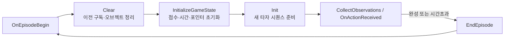
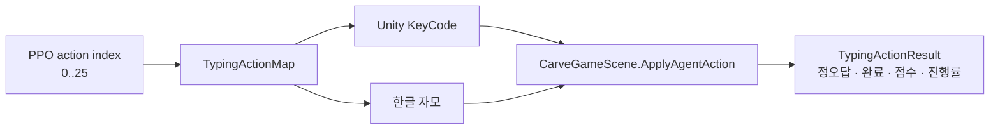
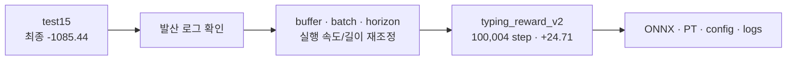

# ML-Agents 실험 기록

타자 미니게임을 반복 가능한 강화학습 환경으로 재구성한 과정과 증빙 경계를 기록합니다. 모든 수치는 저장소에 커밋된 로그를 기준으로 합니다.

## 1. 현재 실행 코드부터 구분하기

`Assets/Scenes/2.Game1.unity`의 `TypingGame` 오브젝트가 참조하는 스크립트 GUID는 `Assets/Scripts/CarveGameScene/CarveGameAgent.cs.meta`와 일치합니다. 따라서 현재 씬 기준 Agent는 [`CarveGameAgent.cs`](../Assets/Scripts/CarveGameScene/CarveGameAgent.cs)입니다.

| 경로 | 분류 | 현재 `2.Game1` 연결 |
|---|---|---|
| [`CarveGameScene/CarveGameAgent.cs`](../Assets/Scripts/CarveGameScene/CarveGameAgent.cs) | 현재 Agent | **연결됨** |
| [`ML/TypingAgent.cs`](../Assets/Scripts/ML/TypingAgent.cs) | 콤보·피버 등 다른 보상 설계 실험 | 연결되지 않음 |
| [`ML-agent/CarveGameAgent.cs`](../Assets/Scripts/ML-agent/CarveGameAgent.cs) | 초기 레거시 버전 | 연결되지 않음 |

이 문서의 환경 계약은 현재 씬에 연결된 `CarveGameScene/CarveGameAgent.cs`를 기준으로 설명합니다.

## 2. 모델보다 게임 루프를 먼저 고친 이유

초기에는 하이퍼파라미터 이전에 학습 경계와 Episode 수명주기가 불명확했습니다. 현재 구조는 씬을 다시 로드하지 않고 타자 게임 상태만 초기화합니다.

```csharp
// Assets/Scripts/CarveGameScene/CarveGameAgent.cs
public override void OnEpisodeBegin()
{
    if (!ResolveGameScene())
    {
        AddReward(TimeoutPenalty);
        EndEpisode();
        return;
    }

    gameScene.Clear();
    gameScene.InitializeGameState();
    gameScene.Init();
}
```



게임과 Agent 사이에는 다음 메서드가 명시적인 경계를 이룹니다.

| 메서드 | 역할 |
|---|---|
| `InitializeGameState()` / `Init()` | 씬 reload 없이 새 Episode 상태 준비 |
| `GetCurrentChar()` | 현재 목표 자모 조회 |
| `GetTrainingProgress01()` | 입력 진행률 조회 |
| `GetCombo()` / `GetRemainingTimeRatio()` | 정규화할 게임 상태 조회 |
| `ApplyAgentAction(int)` | action을 실제 타자 규칙에 적용하고 정오답·완료 결과 반환 |

## 3. 현재 환경 계약

### Observation: 29 floats

```csharp
TypingActionMap.AddOneHotObservation(sensor, gameScene.GetCurrentChar()); // 26
sensor.AddObservation(gameScene.GetTrainingProgress01());                // 1
sensor.AddObservation(Mathf.Clamp01(gameScene.GetCombo() / 5f));         // 1
sensor.AddObservation(gameScene.GetRemainingTimeRatio());                // 1
```

현재 목표 자모만 one-hot으로 표현하고 진행률, 콤보, 남은 시간 비율을 더합니다. 씬의 `BehaviorParameters`에도 Vector Observation Size가 29로 직렬화되어 있습니다.

### Action: Discrete 26



[`TypingActionMap.cs`](../Assets/Scripts/CarveGameScene/TypingActionMap.cs)가 Agent action, 사람의 키보드 입력, 게임의 한글 자모를 한곳에서 매핑합니다.

### Reward와 종료

| 신호 | 값 | 조건 |
|---|---:|---|
| step penalty | -0.001 | 매 action |
| correct | +1 | 목표 자모와 일치 |
| wrong / invalid | -0.2 | 오답 또는 유효하지 않은 action |
| complete | +5 | 전체 입력 시퀀스 완료 후 Episode 종료 |
| timeout | -1 | 제한 시간 종료 후 Episode 종료 |

상수와 종료 분기는 [`CarveGameAgent.cs`](../Assets/Scripts/CarveGameScene/CarveGameAgent.cs)에서 함께 확인할 수 있습니다.

## 4. 첫 실행 `test15`: 중간 개선 후 발산

근거: [`Assets/results/test15/run_logs/training_status.json`](../Assets/results/test15/run_logs/training_status.json)

| checkpoint | steps | reward |
|---|---:|---:|
| 1 | 29,396 | -72.03 |
| 2 | 29,658 | -66.02 |
| 3 | 29,744 | **-26.98** |
| 4 | 31,354 | -73.75 |
| final | 32,080 | **-1085.44** |

29,744 step에서 -26.98까지 개선되었지만 이후 급격히 악화되어 최종 -1085.44로 종료되었습니다. 이 기록만으로 세부 원인을 하나로 단정하지 않고, 적어도 기존 설정에서 학습이 안정적으로 유지되지 않았다는 근거로 사용했습니다.

## 5. 재조정 `typing_reward_v2`

현재 Agent, `2.Game1` 씬 변경, `TypingActionMap`, `typing_reward_v2` 산출물은 저장소의 동일한 구현 이력에서 함께 추가되었습니다. 이 연결을 근거로 v2 결과를 현재 경로의 실험 증빙으로 제시합니다.



| 설정 | test15 | typing_reward_v2 | 변경 의도 |
|---|---:|---:|---|
| `buffer_size` | 12000 | 4096 | 더 짧은 수집 구간에서 업데이트 |
| `batch_size` | 64 | 128 | 한 업데이트의 표본 수 확대 |
| `time_horizon` | 128 | 64 | 짧은 Episode에 맞춘 horizon |
| `max_steps` | 5,000,000 | 100,000 | 실험 주기 제한 |
| `time_scale` | 0.1 | 20 | 시뮬레이션 처리 속도 확대 |
| `no_graphics` | false | true | 학습 실행에서 렌더링 비용 제외 |

근거: [`typing_reward_v2 configuration.yaml`](../Assets/results/typing_reward_v2/configuration.yaml), [`typing_reward_v2 training_status.json`](../Assets/results/typing_reward_v2/run_logs/training_status.json)

| checkpoint | steps | reward |
|---|---:|---:|
| final | 100,004 | **+24.71** |

음수에서 양수 reward로 바뀌고 설정한 실험 길이까지 종료되었습니다. 다만 단일 실행 로그이므로 일반적인 정책 성능이나 사람 대비 우위를 뜻하지 않습니다.

## 6. 보존 산출물

| 파일 | 내용 |
|---|---|
| [`TypingGame.onnx`](../Assets/results/typing_reward_v2/TypingGame.onnx) | 최종 추론 모델 |
| [`TypingGame-100004.onnx`](../Assets/results/typing_reward_v2/TypingGame/TypingGame-100004.onnx) | 100,004 step checkpoint |
| [`checkpoint.pt`](../Assets/results/typing_reward_v2/TypingGame/checkpoint.pt) | PyTorch checkpoint |
| [`configuration.yaml`](../Assets/results/typing_reward_v2/configuration.yaml) | 당시 실행의 resolved 설정과 환경 경로 |
| [`test15`](../Assets/results/test15) | 발산 사례 원본 로그와 checkpoint |

실패한 실행도 지우지 않았습니다. 성공 결과만이 아니라 어떤 설정이 유지되지 못했는지 함께 검토할 수 있게 하기 위해서입니다.

## 7. 재현 범위

### Editor Play

Unity 2021.3.45f2에서 `Assets/Scenes/2.Game1.unity`를 직접 열고 Play합니다. 이 씬은 원작 전체 진행과 분리된 ML 검토용 데모이며, `BehaviorParameters`에 `Assets/results/typing_reward_v2/TypingGame.onnx`가 연결되어 있어 별도 플레이어 빌드나 Python trainer 없이 추론을 확인할 수 있습니다.

### 선택: Editor 학습 연결

Python ML-Agents 0.26.0 환경에서 다음 입력 설정을 사용합니다.

```bash
mlagents-learn Assets/Config/craft.yaml --run-id=typing_editor_v1
```

터미널이 Unity 연결을 기다리면 같은 `Assets/Scenes/2.Game1.unity`를 열고 Play합니다. `Behavior Type: Default`이므로 trainer가 연결되면 외부 정책을 사용하고, 연결되지 않으면 씬에 지정된 ONNX로 추론합니다. 보존된 `Assets/results/typing_reward_v2/configuration.yaml`은 당시 결과 폴더와 실행 환경 경로를 포함한 증빙이므로 새 입력 파일로 직접 덮어쓰지 않습니다.

| 환경 | 버전/설정 |
|---|---|
| Unity | 2021.3.45f2 |
| Unity ML-Agents package | 2.0.1 (`Packages/manifest.json`) |
| Python ML-Agents trainer | 0.26.0 (v2 로그 metadata) |
| PyTorch | 1.8.1 (v2 로그 metadata) |
| 알고리즘 | PPO |

## 8. 이 실험이 증명하는 것과 아닌 것

**확인 가능한 범위**

- 기존 타자 게임 루프를 씬 reload 없이 반복 가능한 Episode로 재구성한 코드
- 관측·행동·보상과 실제 게임 규칙 사이의 경계
- 실패와 재조정 결과를 비교할 수 있는 로그와 모델 산출물

**이 자료만으로 증명하지 않는 범위**

- 실제 게임의 재미나 레벨 디자인 개선
- 에이전트가 사람보다 뛰어난 플레이를 한다는 주장
- 여러 seed와 미관측 데이터에서의 일반화 성능
- 상용 QA 파이프라인 수준의 자동화

reward 개선은 학습 지표이며 게임 품질 지표가 아닙니다.
